  

  
  
  

## About

Toward the end of my third year of university, I founded **SalesBop** — an AI sales coaching platform — and committed fully to building it. Over the next ~2 years, I took it from concept → shipped product → GTM execution → acquisition.

After graduating, I led every facet of the company: architecture and technical implementation, product iteration loops, outbound/customer acquisition systems, and day-to-day operations.

On **Feb 26, 2025**, we officially closed the acquisition by **FliteHouse**. Today, I lead the technology team there, continuing to scale what we started — now with a larger team and a broader mission to unify people, process, and technology into one cohesive revenue ecosystem.

Currently my favorite paper is [this one](https://arxiv.org/html/2512.09882v1).

## Stack

  

## GitHub

  <picture>
    <source media="(prefers-color-scheme: dark)" srcset="https://github-readme-stats.vercel.app/api?username=nikos118&show_icons=true&hide_border=true&bg_color=0d1117&title_color=ffffff&text_color=888888&icon_color=cccccc&ring_color=ffffff"/>
    
  </picture>
  &nbsp;&nbsp;
  <picture>
    <source media="(prefers-color-scheme: dark)" srcset="https://streak-stats.demolab.com?user=nikos118&hide_border=true&background=0D1117&ring=FFFFFF&fire=CCCCCC&currStreakLabel=999999&sideLabels=888888&currStreakNum=FFFFFF&sideNums=CCCCCC&dates=555555"/>
    
  </picture>

  

  

  

